# Deepfake Image Detection
## Using Deep Learning to Predict a Deepfake 

**Author**: Jeff Spagnola

The contents of this repository detail an analysis of a Flatiron School capstone project. This analysis is detailed in hopes of making the work accessible and replicable.

<h4><center><b> Access the dataset for this project from Google Drive by clicking <a href="https://drive.google.com/file/d/1b-GA8_23MGmbEBsuEluKVm90QJ1kLEtV/view?usp=sharing">here</a>.</center></b></h4>

<center> 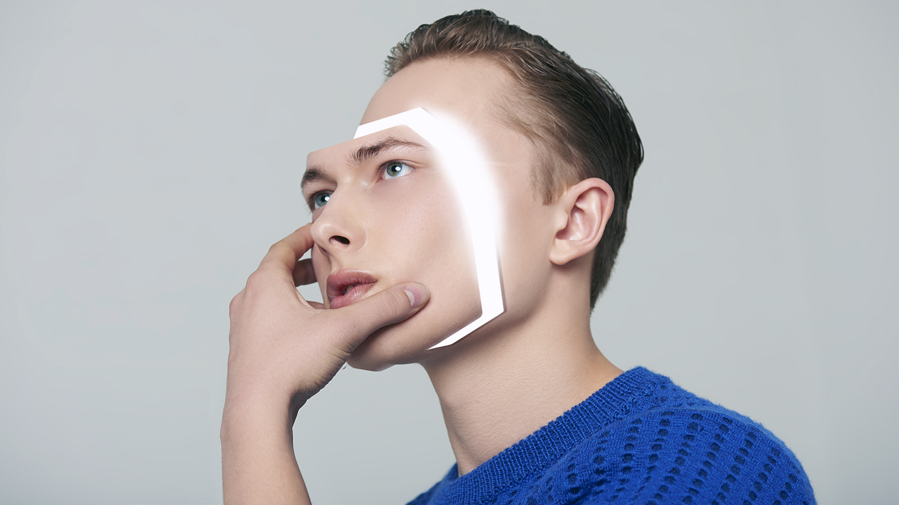 </center>

## Abstract
In recent years, deepfake technology has made huge leaps in terms of accuracy, quality, and most of all: believability.  At one time or another, we've all been fooled by a photoshopped viral image or even someone's Snapchat filter.  The abilitly to determine whether or not an image is, in fact, real is quickly becoming a necessity in a world that's becoming more and more susceptible to "questionable" information.  Recently, doctored images have made headlines and divided people in their opinions of whether real world issues were legitimate.

In this project, I set out to build an image classification system that can determine whether an image is real or a well done deepfake.  In order to achieve this, I built several iterations of convolutional neural networks that trained on hundreds of thousands of images of human faces, roughly half real images and half generated images.  After creating a CNN that I personally tuned, creating a CNN with a pretrained model, and creating an ensemble of both, I was able to achieve a 97% accuracy in the detection of real vs. deepfake images.  With this level of accuracy on the training and test sets, I felt that it was ready to be deployed to web app where users can upload a new, untrained face image and the model can determine the validity of their image as well as explain how it came to that conclusion. 

Click here to access the web app and test the model.


## Introduction:
<center>  </center>
Take a second to look at the images above.  Can you tell which of these photos are real and which are deepfake image?  If you guessed that any of these photos are real...you're wrong...because they're ALL fake.  

Image and video editing technology has improved so much in such a short period of time and it has become nearly impossible to tell when an image is real or a very well done facimile.  These "deepfakes" are more than just creepy.  This fake image technology has a very real potential of becoming a serious issue in the years to come.  It's fun to do Snapchat face-swaps with friends...but what about when we can create nearly undetectable images that start to influence the news and society at large.  Celebrities and world leaders already deal with issues stemming from deepfake images, but what's stopping someone from creating fake images of you?

The goal of this project is to develop a system that has the ability to determine whether a given image is either real or a deepfake.  As you can see above, we're not able to trust the naked eye for this task.  Once completed, this deepfake image detection system can be used in many sectors, including social media companies, security organizations and news agencies. 


## Data
> The dataset used int his project was created by combining the contents of of several datasets of faces from Kaggle.  After a rather exhaustive search to find datasets with images of similar quality, we settled using a random combination of images from here, here & here.  Once imported, he dataset was split into a training set, test set, and validation set totaling 142, 286 images, nearly equally distributed between "real" and "fake".

>You can access the dataset from Google Drive by clicking [here](https://drive.google.com/file/d/1b-GA8_23MGmbEBsuEluKVm90QJ1kLEtV/view?usp=sharing).

## Process
The data was analyzed using the OSEMN data science method and during this presentation we will walk through each step of this process as well as share the results.

## Scrubbing
> In order to be able to feed our dataset of images into the models, we first need to convert the images into arrays and then split the images into test, train, validation sets.

### Prepping the Data
After importing the folders of images, we used the ImageDataGenerator to rescale, resize, and separate the image classes.

```python
training_set = ImageDataGenerator(rescale=1./255).flow_from_directory(train_folder, 
                                                           target_size = (64, 64), 
                                                           class_mode = 'binary',
                                                           batch_size = num_train_images)

test_set = ImageDataGenerator(rescale=1./255).flow_from_directory(test_folder, 
                                                          target_size = (64, 64), 
                                                          class_mode = 'binary',
                                                          batch_size = num_test_images)

val_set = ImageDataGenerator(rescale=1./255).flow_from_directory(validation_folder, 
                                                         target_size = (64, 64), 
                                                         class_mode = 'binary',
                                                         batch_size = num_val_images)

```
Once this step was complete, we were able to create the training set, test set, and validation sets.  

```python
X_train, y_train = next(training_set)
X_test, y_test = next(test_set)
val_x, val_y = next(val_set)

```

Next, we use array_to_img from Tensorflow to check images from the dataset and make sure they were properly scaled and sized.

```python
array_to_img(X_train[0])

```
 

Everything looks good and after making sure that the training, testing, and validation sets have proper shapes, we'll be ready to jump into modeling.

```python
m_train = X_train.shape[0]
num_px = X_train.shape[1]
m_test = X_test.shape[0]
m_val = val_x.shape[0]

print ("Number of training samples: " + str(m_train))
print ("Number of testing samples: " + str(m_test))
print ("Number of validation samples: " + str(m_val))
print ("train_images shape: " + str(X_train.shape))
print ("train_labels shape: " + str(y_train.shape))
print ("test_images shape: " + str(X_test.shape))
print ("test_labels shape: " + str(y_test.shape))
print ("val_images shape: " + str(val_x.shape))
print ("val_labels shape: " + str(val_y.shape))

```

<center><b>Number of Images by Class - Training Set</b></center>


<center><b>Number of Images by Class - Test Set</b></center>
 

<center><b>Number of Images by Class - Validation Set</b></center>
 


## Modeling
> After preprocessing the images, we embarked on an EXHAUSTIVE journey of modeling the data.  Convolutional Neural Networks are regarded as the go-to model for computer vision tasks, so we decided to experiment with several different methods of implementing CNN's.  

> Below, you will find the model architecture and results from a simple, baseline CNN, a CNN that was tuned through a lengthy process of trial and error, a CNN using a pretrained model (Xception), and an ensemble model combining the architectures of the tuned CNN and pretrained CNN. 

### Baseline CNN
> The first model we experimented with is just a simple baseline CNN.  Here, we used two small neuron Conv2D layers that are fed into a single Dense output layer.  

```python
# Early Stopping
callback = EarlyStopping(monitor = 'val_acc', patience = 3, mode = 'max',
                         min_delta = .1, restore_best_weights = True)

# Create base neural network
baseline_model = Sequential()

# Hidden Layers
baseline_model.add(Conv2D(32, (3, 3), activation = 'relu', input_shape = (64, 64, 3)))
baseline_model.add(MaxPooling2D((2, 2)))

baseline_model.add(Conv2D(16, (3, 3), activation = 'relu'))
baseline_model.add(MaxPooling2D((2, 2)))

baseline_model.add(Flatten())

# Output Layer
baseline_model.add(Dense(1, activation = 'sigmoid'))

# Compile Model
baseline_model.compile(optimizer = 'RMSProp', loss = 'binary_crossentropy', 
              metrics = ['acc'])

# Get the model summary
print(baseline_model.summary())

# Fit Model
history = baseline_model.fit(X_train, y_train, batch_size = 64, epochs = 25, 
                    validation_data = (val_x, val_y), callbacks = callback)

# Evaluating the model 
evaluate_network(history, baseline_model, X_test, y_test)

```
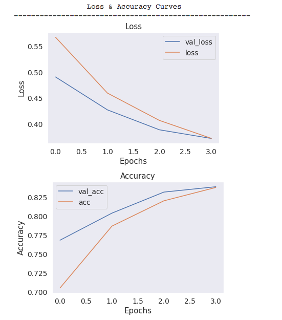 

 

> Our baseline model performed admirably, but we definitely want to achieve a much higher level of accuracy for a proper deepfake detection app.  Luckily, we can do a bunch of parameter tuning in order to make this model MUCH more accurate.

### CNN with Parameter Tuning
> In this model, we expanded the architecture to include several more Conv2D and Dense layers, as well as several layers of BatchNormalization to prevent serious ovefitting.  

#### Model Architecture
```python
# Early Stopping
callback = EarlyStopping(monitor = 'val_acc', patience = 3, mode = 'max',
                         min_delta = .01, restore_best_weights = True)

# Create base neural network
model_2 = Sequential()

# Hidden Layers
model_2.add(Conv2D(128, (3, 3), activation = 'relu', input_shape = (64, 64, 3)))
model_2.add(BatchNormalization(momentum=0.95, 
          epsilon=0.005))
model_2.add(MaxPooling2D((2, 2)))

model_2.add(Conv2D(64, (3, 3), activation = 'tanh'))
model_2.add(BatchNormalization(momentum=0.95, 
          epsilon=0.005))
model_2.add(MaxPooling2D((2, 2)))

model_2.add(Conv2D(32, (3, 3), activation = 'tanh'))
model_2.add(BatchNormalization(momentum=0.95, 
          epsilon=0.005))
model_2.add(MaxPooling2D((2, 2)))

model_2.add(Conv2D(16, (3, 3), activation = 'tanh'))
model_2.add(BatchNormalization(momentum=0.95, 
          epsilon=0.005))
model_2.add(MaxPooling2D((2, 2)))

# Flatten
model_2.add(Flatten())

# Dense Layers
model_2.add(Dense(64, activation = 'relu'))
model_2.add(Dense(32, activation = 'relu'))

# Output Layer
model_2.add(Dense(1, activation = 'sigmoid'))

# Compile Model
model_2.compile(optimizer = 'sgd', loss = 'binary_crossentropy', 
              metrics = ['acc'])

# Get the model summary
print(model_2.summary())

# Fit Model
history_2 = model_2.fit(X_train, y_train, batch_size = 16, epochs = 25, 
                    validation_data = (val_x, val_y), callbacks = callback, 
                    workers = 16)

# Evaluating the model 
evaluate_network(history_2, model_2, X_test, y_test)
```

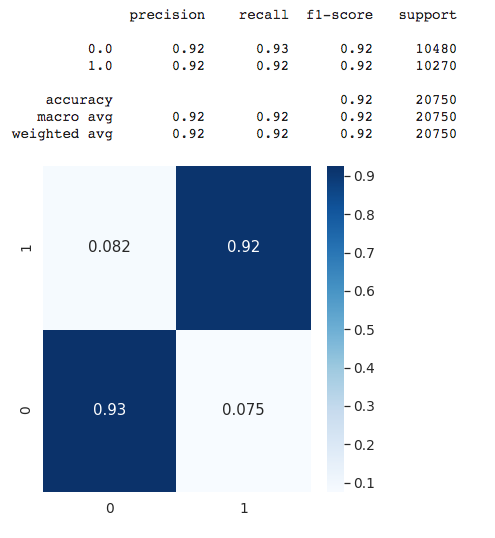 

> The accuracy of this model is much better than the baseline CNN as it has now cracked 90% with an almost equal recall.  For the purposes of this project, recall is an important metric as we'd rather have a false positive than a false negative. To make sure we're definitely getting an accurate picture of how the model is performing, we also tested it against the validation set and saw similar results in terms of accuracy and recall.  Therefore, we can make the assumption that this model is performing in a consistent manner. 

#### Testing on a Single Image
> In order to deploy this model into an app, we want to run several tests to see how the model works with a single image as that is how the app will work.  

```python
def test_single_image(test_file_path, model, image_class):
    ''' Test a single image to see if the model is properly predicting.
        Image class is either 1 or 0.'''

    test_img = image.load_img(test_file_path, target_size= (64, 64))
    test_tensor = image.img_to_array(test_img)
    test_tensor = test_tensor.reshape(1, 64, 64, 3)
    test_tensor /= 255.

    # Get prediction
    test_pred = model.predict(test_tensor).round()

    # Output
    print('The true class of this image is: ', img_class)
    print('The predicted class of this images is: ', test_pred)

```
```python
test_file_path = '/Deepfake-images V2/val/real/00005.jpg'
img_class = 1
test_single_image(test_file_path, tuned_nn_updated, img_class)

```
The true class of this image is:  1
The predicted class of this images is:  [[1.]]

> The model is properly predicting the correct class of a random image from the validation set, so we could definitely use this model in the final product.  Still, we believe that we can achieve a higher rate of accuracy with other CNN methods so we can continue to explore other options.

### CNN with Pretrained Network
> In this model, we experimented with using a pretrained model from Keras.  Keras has several pretrained models that can be used for computer vision.  We settled on the Xception model after our research seemed to point to it being a good starting point for image classification task.  

#### Model Architecture
```python
# Early Stopping
callback = EarlyStopping(monitor = 'val_acc', patience = 3, mode = 'max',
                         min_delta = .01, restore_best_weights = True, verbose = 2)

# Create model
model_3 = Sequential()

# Create the base with Xception
conv_base = Xception(weights = 'imagenet', include_top = True, 
                     classifier_activation = 'softmax') 
conv_base.trainable = False
model_3.add(conv_base)

model_3.add(Flatten())

# Add Dense Layers
model_3.add(Dense(256, activation = 'tanh'))
model_3.add(Dense(128, activation = 'tanh'))
model_3.add(Dense(64, activation = 'tanh'))
model_3.add(Dense(32, activation = 'tanh'))
model_3.add(Dense(16, activation = 'tanh'))

# Output layer
model_3.add(Dense(1, activation = 'sigmoid'))

# Compile 
model_3.compile(optimizer = 'adam', loss = 'binary_crossentropy', 
              metrics = ['acc'])

# Get the model summary
print(model_3.summary())

# Fit Model
history_3 = model_3.fit(X_train, y_train, batch_size = 64, epochs = 25, 
                    validation_data = (val_x, val_y), callbacks = callback)

# Evaluating the model 
evaluate_network(history_3, model_3, X_test, y_test)

```
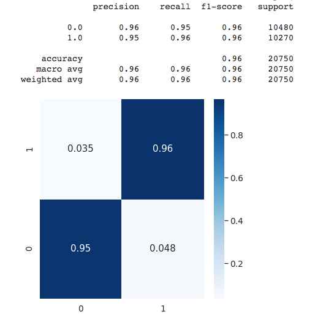 

> The CNN using a pretrained convolutional base was much more accurate, but only after retraining the pretrained convulational base.  Without making the base trainable, the results were actually much much worse than our "home made" model.  The accuracy is great, but massive increase in training time may make this model unrealistic for future deployment.  
Again, the accuracy and recall is similar when testing with the validation set so we are able to assume that the model is performing consistently. 

#### Testing on Single Image
> Again, we want to test this model on a single image to make sure that it would perform well if deployed to the deepfake detection app.  

```python
test_file_path = '/Deepfake-images V2/val/real/00005.jpg'
img_class = 1
test_single_image(test_file_path, pt_network_updated, img_class)

```
The true class of this image is:  1
The predicted class of this images is:  [[1.]]

> This model is accuractely predicting the class of a single image, so this can also potentially be used for the final product.  However, the long training time and longer loading time may make this unrealistic.  

### Creating an Ensemble of CNN's
> We went through several methods of creating an ensemble classifier of neural networks with very little success and all sorts of crazy errors and bad results.  After googling for what felt like an eternity, we were able to stumble on to <a href="https://towardsdatascience.com/destroy-image-classification-by-ensemble-of-pre-trained-models-f287513b7687">this excellent blog post</a> that helped to steer me in the right direction.  

#### Model Architecture
```python
models = [tuned_nn_updated, pt_network_updated]
for i, model in enumerate(models):
  for layer in model.layers:
    layer.trainable = False

ensemble_visible = [model.input for model in models]
ensemble_outputs = [model.output for model in models]

# Concatentate
merge = tf.keras.layers.concatenate(ensemble_outputs)

# Early Stopping
callback = EarlyStopping(monitor = 'val_acc', patience = 3, mode = 'max',
                          min_delta = .01, restore_best_weights = True, verbose = 2)

# Add layers
merge = Dense(32, activation = 'relu', name = 'dense_edit')(merge)
output = Dense(1, activation = 'sigmoid', name = 'dense_output')(merge)

ensemble_model = Model(inputs = ensemble_visible, outputs = output)

# Compile
ensemble_model.compile(optimizer = 'adam', loss = 'binary_crossentropy', metrics = ['acc'])

# Reshape Data (to make the model work)
X_train_ensemble = [X_train for _ in range(64)]
X_test_ensemble = [X_test for _ in range(64)]
val_x_ensemble = [val_x for _ in range(64)]

# Fit the ensemble
ensemble_history = ensemble_model.fit(X_train_ensemble, y_train, batch_size = 64, epochs = 25, 
                    validation_data = (val_x_ensemble, val_y), callbacks = callback)

# Evaluating the model 
evaluate_network(ensemble_history, ensemble_model, X_test_ensemble, y_test)

```
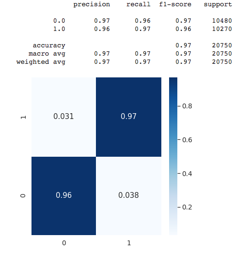 

> Using this particular ensemble, there was a 1% boost in accuracy and a slight boost in recall as well.  Given that the data needs to be reshaped in order to make this model work plus the extra training time, we don't feel like it would be worth it to use this model in the final product. 


## Interpret
> Based on the results of the modeling, we decided on using the CNN that we tuned ourselves as the quicker training time and loading time makes up for the few percentage points of accuracy tha we gain from the other models.  Now that we know that the model is functional, we want to get some insght into how they work.  Below are a few methods of explaining how the CNN is predicting whether an image is real or a deepfake. 

### Intermediate Activations
> In order to get a better sense of how the model is working, we can visualize the feature maps generated during training.  Since we know the CNN works by applying a filter in sequence over an image, we can actually see what each iteration of that filter looks like.  

```python
# Transform to a tensor and visualize
img_tensor = image.img_to_array(img)
img_tensor = np.expand_dims(img_tensor, axis= 0)
img_tensor /= 255.

# Check Shape
print(img_tensor.shape)

# Preview Image
plt.imshow(img_tensor[0])
plt.show()

```
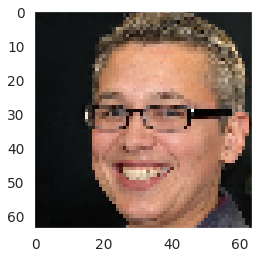 

> Let's check out the visual for the first layer of the model.

```python
# Getting model layer output
layer_outputs_single = [layer.output for layer in tuned_nn_updated.layers[:8]]

# Make a model to display feature maps
activation_model_single = models.Model(inputs = tuned_nn_updated.input, outputs = layer_outputs_single)

# Get an array for the activation layer
activations_single = activation_model.predict(img_tensor)
first_layer_activation = activations_single[0]

# Plot the thing
plt.matshow(first_layer_activation[0, :, :, 3], cmap = 'viridis')
plt.show()

```
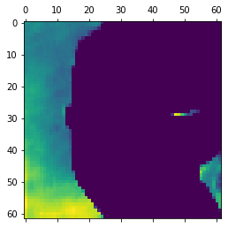 

> Now let's plot the visuals of several layers.

```python
fig, axes = plt.subplots(8, 4, figsize=(12,24))
for i in range(32):
    row = i//4
    column = i%4
    ax = axes[row, column]
    first_layer_activation = activations_single[0]
    ax.matshow(first_layer_activation[0, :, :, i], cmap='viridis')

```
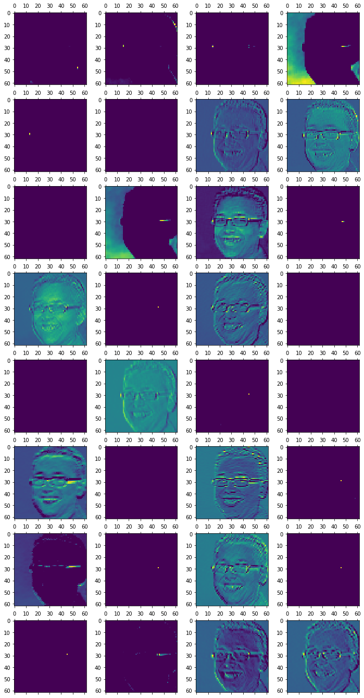 


### Lime
> In order to get a more in depth picture of what's happening here, we'll use the Lime Image Explainer to get a deeper insight into how the model is operating.

```python
def lime_explainer_image(image_from_test_set, image_label):
    '''Sets up lime explainer and also will display explanation images.
     Image must be in the format of dataset[slice] as in X_test[0].
     Image can be any sliced image from test set.
     Image label is y_test[0] or y_test[1]'''
    
    # Message
    print('This may take a few minutes...')
    
    # Create explainer 
    explainer = lime_image.LimeImageExplainer(verbose = False)
    segmenter = SegmentationAlgorithm('slic', n_segments = 100, compactness = 1, sigma = 1)

    # Set up the explainer
    new_explanation = explainer.explain_instance(image_from_test_set, classifier_fn= pt_network_updated,
                                             top_labels = 2, hide_color = 0, num_samples = 1000, 
                                             segmentation_fn = segmenter)

    # Plot the explainer
    temp, mask = new_explanation.get_image_and_mask(image_label, positive_only=True, num_features=5, hide_rest=False)
    fig, (ax1, ax2) = plt.subplots(1,2, figsize = (8, 4))
    ax1.imshow(label2rgb(mask,temp, bg_label = 0), interpolation = 'nearest')
    ax1.set_title('Positive Regions for {}'.format(image_label))
    temp, mask = new_explanation.get_image_and_mask(image_label, positive_only=False, num_features=10, hide_rest=False)
    ax2.imshow(label2rgb(3-mask,temp, bg_label = 0), interpolation = 'nearest')
    ax2.set_title('Positive & Negative Regions for {}'.format(image_label))
    
```
```python
lime_explainer_image(X_test[0], y_test[0])

```
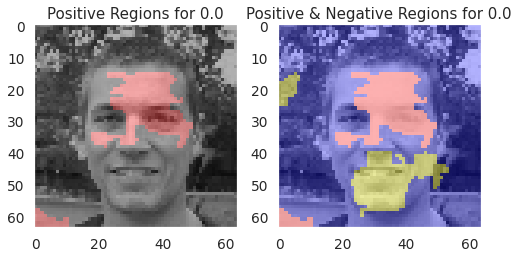 

```python
lime_explainer_image(X_test[100], y_test[0])

```
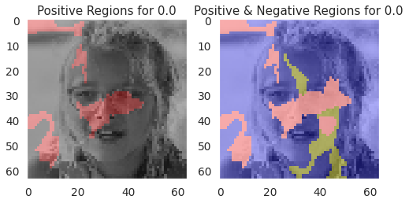 

```python
lime_explainer_image(X_test[11900], y_test[0])

```
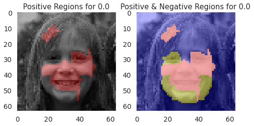 

```python
lime_explainer_image(X_test[346], y_test[0])

```
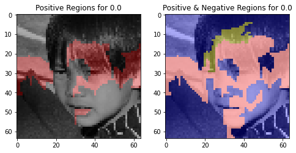 

```python
lime_explainer_image(X_test[5426], y_test[0])

```
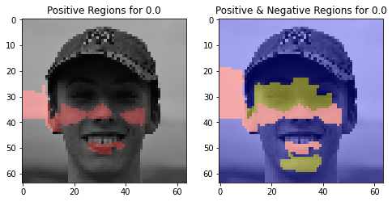 


> The Lime Explainer provided a really interesting bit of insight into how the model is detecting whether the image is a deepfake.  If you notice, in all the examples that we produced, Lime highlighted at least one of the eyes.  This must mean that the area surrounding the eyes is a main determining factor. 

## Conclusion

The technology of image and video editing has made huge leaps in recent years and the emergence of deepfake images have caused serious problems already and have the potential to become more of an issue in the future as the technology improves.  Currently, it's very difficult to tell the difference between a real image and a computer generated deepfake and, in many cases, deepfakes are indecipherable by the naked eye.  

The goal of this project is to develop a system that has the ability to determine whether a given image is either real or a deepfake.  As you can see above, we're not able to trust the naked eye for this task.  Once completed, this deepfake image detection system can be used in many sectors, including social media companies, security organizations and news agencies. 

<h4><br><b><center>We were able to construct an app that can determine whether an image is real or a deepfake.  <br>You can check out the app here. </center></b></h4>

#### Results
<b>After analysing and modeling the data, we have come to the following results:</b>
 - Convolutional Neural Networks can produce very accurate results for image classification problems.

 - Pretrained neural networks such as Xception are a valuable tool to increase the accuracy of a CNN, but in this case, the paramters need to be retrained which leads to very lengthy training time.  
 
 - Using an ensemble model yielded slightly better results than a pretrained network, but the complications surrounding it make it a difficult choice.
 
 - As far as how the model predicts deepfakes, the Lime Explainer shows that the model tends to focus on the eyes in order to make a determination.  

## Recommendations:

</b>Based on this analysis, we can offer the following recommendations:</b>
 - When using a pretrained network, we recommend allowing the parameters of that model to be retrained as it improves accuracy tremendously.
 
 - If you're looking for the most accurate model possible, we recommend using an ensemble of both a finely tuned CNN and a pretrained CNN that allows for parameter retraining.

 - In terms of deploying a model to a deepfake detection app, we recommend using a very finely tuned CNN as it is the fastest model we used and also has a high degree of accuracy.  
 
 - We recommend that social media companies use the current version of the Deepfake Image Detection app in order to weed out bots that use computer generated deepfakes to legitimize fake profiles.  


## Future Work

</b>With more time, we can improve this project in the following ways:</b>
- Add additional images to the dataset as having more data will inherently make the models more accurate.

- Expand the scope of this project to include being able to scan video for deepfakes as this is increasingly becoming problematic technology.

- Expand the capability of the model to account for all types of altered images (poor photo shops, animations, etc) in order to have a more complete detection system than just hyperrealistic deepfake images.

- Update the associated web App to be more user-friendly and have more features for deepfake image classification.


### For further information
Please review the narrative of our analysis in [our jupyter notebook](./main_notebook.ipynb) or review our [presentation](./SampleProjectSlides.pdf)

For any additional questions, please contact **jeff.spags@gmail.com)


##### Repository Structure:

Here is where you would describe the structure of your repoistory and its contents, for exampe:

```

├── README.md                       <- The top-level README for reviewers of this project.
├── main_notebook.ipynb             <- narrative documentation of analysis in jupyter notebook
├── presentation.pdf                <- pdf version of project presentation
└── images
    └── images                          <- both sourced externally and generated from code

```
